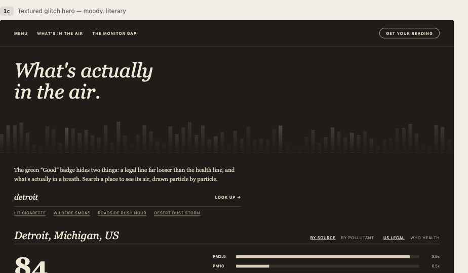
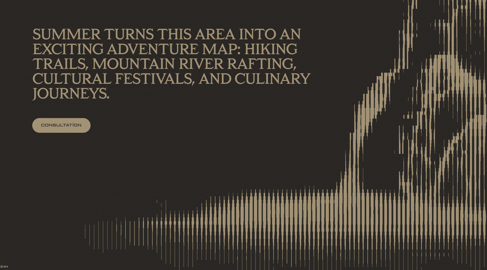
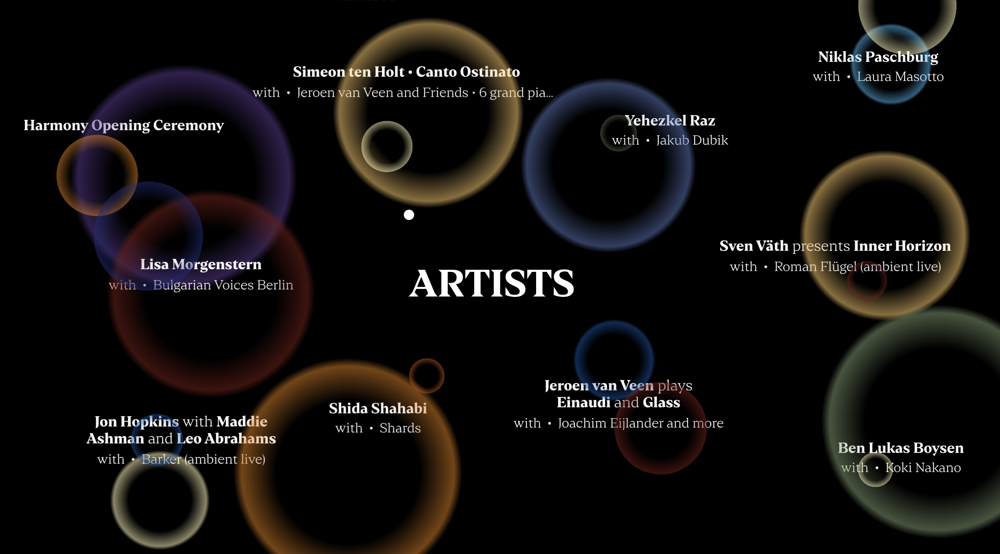

# What's in the Air — Redesign Spec (Style 2: Dark Editorial Serif)

This is the handoff spec for rebuilding the **"What's in the Air"** air-quality tool
in the **Style 2 — Dark Editorial Serif** direction. It covers the visual system, the
two chosen layout takes, the content hierarchy, and the planned move to a 3D particle
system. Build it as a single streaming Design Component (`.dc.html`).

---

## What the app does (content, unchanged)

A user searches a ZIP/city (or picks a canned scenario) and sees that place's air
quality, "drawn particle by particle." The editorial angle: **the green "Good" badge
hides two things — a legal line far looser than the health line, and what's actually
in a breath.**

Every screen must preserve this content hierarchy:

1. **Masthead / nav** — product name + a couple of nav links (`What's in the Air`,
   `The Monitor Gap`).
2. **Thesis line** — the "green Good badge hides two things…" framing sentence.
3. **Search** — city/ZIP input + submit, plus scenario shortcuts
   (`Lit cigarette`, `Wildfire smoke`, `Roadside rush hour`, `Desert dust storm`).
4. **Result** for the searched place:
   - Place name + AQI number (`84`) + category (`Moderate`).
   - **Two toggles:** `By source` / `By pollutant`, and `US legal line` / `WHO health line`.
   - The **particle field** (the hero visualization — see 3D section below).
   - **Comparison bars** — each pollutant (PM2.5, PM10, O₃, NO₂, SO₂, CO, Dust) shown
     as a multiple of the WHO / US line (`PM2.5 → 3.9×`, etc.).
   - **The monitor-gap note** — "measured from a station 20mi away… only ~1 in 5 US
     counties has a monitor at all," to be honest that the number is stretched over a gap.
5. **Source citation** — Open-Meteo Air Quality API (CAMS model).

Don't add filler. Everything above earns its place; nothing else should appear.

---

## Visual system — Style 2

**Mood:** moody, literary, atmospheric. The air is treated as an *atmosphere* and a
*reckoning*, not a dashboard. Two sub-variants of the same system were explored.

### Palette
- **Charcoal ground:** `#1f1c19` (near-black, warm).
- **Sand text:** `#d9cdb8`; brighter headline sand `#f1e9d8`; muted label sand `#a8987e`.
- **Track / hairline:** `#37312a`, dividers `#4a443c`.
- Keep saturation low; this is a warm neutral world, not a colorful one.
- **Dusk-gradient variant** replaces the flat ground with a vertical
  `#191338 → #4a2c56 → #a8563f → #d9a15c` (indigo night → amber dawn) and text in `#f6efe0`.

### Type
- **Display / headlines:** a serif — Georgia stands in; swap for a refined editorial
  serif (e.g. a Times/Freight/Canela-class face). Large, often **italic** for the
  poetic lines ("Yesterday, the air did something.").
- **Labels / nav / meta:** `system-ui` (or a neutral grotesque) in **UPPERCASE, tracked**
  (`letter-spacing: .08–.12em`), small (11px).
- **Micro-meta / editions:** monospace, tracked, low-opacity (`ui-monospace`).

### Components
- Nav = tracked uppercase links; primary CTA = **pill outline button** ("Get your reading").
- Search = **underlined text field**, italic placeholder, trailing `→`. No boxy input.
- Scenario shortcuts = **underlined uppercase text links**, not filled chips.
- Toggles = inline text tabs; the active option is **underlined + brighter sand**.
- Comparison bars = thin flat bars (8px), sand fill on `#37312a` track, value at right.
- Big AQI number set in the display serif (60–72px).

### Two takes (see screenshots)
- **`1c` — Textured glitch hero:** full-bleed dark hero, a vertical-bar "glitch" texture
  (borrowed from the Style-2 reference sites) bleeding from the top edge and fading into
  the ground, big italic serif headline over it, then the data section below.
  *Best when the particle field is the star.*
- **`1d` — Dusk gradient:** vertical dusk→dawn gradient, centered italic headline, an
  eyebrow (`— A BRIEF RECKONING —`), underlined search, a ticker of cities, and the data
  result in a translucent glass card. *More poetic / editorial-cover feel.*

Recommend building `1c` as the primary and keeping `1d`'s gradient + centered
type as an alternate hero treatment.

### Screenshots
The `1c` mockup of this tool, plus the reference sites the glitch/gradient
texture is borrowed from:

---

## The particle field → moving to 3D

Today the particle field is a flat 2D scatter (p5). **We plan to move to three.js (or a
similar GPU particle system)** for performance and, more importantly, to make the field
**genuinely 3D — you can scroll/travel *through* the air** rather than look at a flat plane.

Direction for whoever builds it:
- **Depth + travel:** particles distributed in a 3D volume; scroll (and/or drag) moves
  the camera through it. Parallax and depth-of-field as you pass pollutant clusters.
- **Dot appearance:** the dots should read **closer to the Style 4 reference** — soft,
  luminous, halftone/point-cloud particles that aggregate into a recognizable form and
  sit against darkness with gentle glow, rather than hard flat CSS dots. Use the two
  references below as the visual target for particle rendering (grain, glow, density
  falloff, how points cohere into a shape).
- **Mapping to data:** particle **count/density** = concentration; **color** = pollutant
  (keep a consistent per-pollutant hue); the `US legal` / `WHO health` toggle rescales
  how "full" / how far over the line the field reads.
- Keep it inside the Style-2 charcoal world — glow tuned warm, not neon.

### Particle look references (target for the 3D dots)

> Note: these Style-4 images are a reference **for the particle rendering only** — the
> surrounding UI, type, and palette should stay Style 2 (dark editorial serif).

---

## Build notes (original design-component brief)
- Single streaming `.dc.html`; inline styles only (no stylesheets/classes).
- Load the editorial serif via `<link>` in `<helmet>`; define `a` / `a:hover` colors.
- The three.js/particle canvas will be an external module mounted via `<x-import>`;
  everything else (masthead, search, toggles, comparison bars, monitor-gap note) is
  plain template markup so it stays editable.
- Persist the searched place + toggle state; persist camera/scroll position of the field.

---

## Implemented (in *this* React app)

This spec was built directly into the existing React tool rather than as a fresh
`.dc.html`. What shipped, and why it differs from the brief:

**The look is a swappable theme, not hardcoded.** All colour/gradient tokens live
in one `:root` block in `src/index.css` ("design tokens"); `tailwind.config.js`
points the existing semantic names (`cream`, `ink`, `grid-*`…) at those variables
via `rgb(var(--x) / <alpha-value>)`. So the *entire* page — chrome, cards, and the
p5 canvas (which reads `--ground` back out) — reskins by editing that one block. A
different design in this family is a token swap, not a component rewrite.

- **Palette / atmosphere:** the dusk gradient variant is the default — a fixed
  `body::before` sky (indigo night → amber dawn). The `1c` glitch texture is a
  pure-CSS `.glitch-texture` (a masked repeating-linear-gradient) bleeding from the
  hero's top edge. Both together, since both were wanted.
- **Type:** Fraunces (editorial serif) via one `<link>`, Georgia fallback; tracked
  uppercase `system-ui` for labels (`.label-caps`).
- **Chrome:** editorial masthead + pill CTA (`Layout.jsx`), big italic serif hero +
  underlined text search + underlined-caps scenario links (`AirPage.jsx`,
  `LookupInput.jsx`), text-tab toggles, dark-glass `gourmetMediaContainer`.

**Particles: a real 3D volume — deliberately NOT three.js, and not even WebGL.**
The brief called for three.js; we didn't add it (a whole scene-graph/camera/shader
API to keep working for a small site fights "openable in 10 years with no worry").
Instead the **"by source" view in `src/viz/airParticleSketch.js` is a true 3D point
cloud rendered on a plain 2D canvas**: specks live at 3D positions in a box; each
frame we rotate the world (orbit), perspective-project in ~15 lines of JS, and blit
cached radial-glow sprites with raw `ctx.drawImage` + `'lighter'` (additive)
compositing. Nearer orbs draw bigger and brighter, so it reads — and travels — as a
volume. Interactions: **drag to orbit, wheel to zoom (only over the canvas), pinch
on touch**; `touch-action: pan-y` keeps vertical swipes scrolling the page so the
canvas never traps a phone user. Camera state is module-scoped, so orbit/zoom
survive React remounts (every toggle remounts the sketch).

Two rendering languages, on purpose: the luminous 3D treatment is **only** the
source field. The baseline atmosphere and the by-pollutant rings stay the original
**crisp white-outlined 2D dots** — far clearer for concentric structure.

Perf notes for whoever touches this next: the frame is ~1,400 (800 on mobile)
`drawImage` blits — cheap and GPU-composited. **Never reintroduce p5's `tint()` in
the 2D renderer** (it re-renders the sprite through a temp canvas per call and was
the original frame-rate killer — per-speck alpha is `ctx.globalAlpha` instead), and
keep `backdrop-filter` off the cards. The particle palette (`composition.js`
SOURCES, `pollutants.js` colours) is luminised so dark specks (e.g. soot) actually
glow on the charcoal ground.

*If the field ever needs an order of magnitude more particles, that's the point to
reach for p5's WEBGL mode or three.js — and only `airParticleSketch.js` +
`P5Sketch.jsx` would change.*
